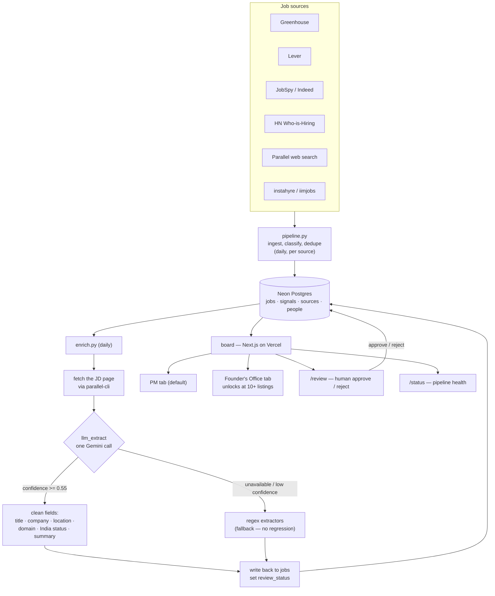
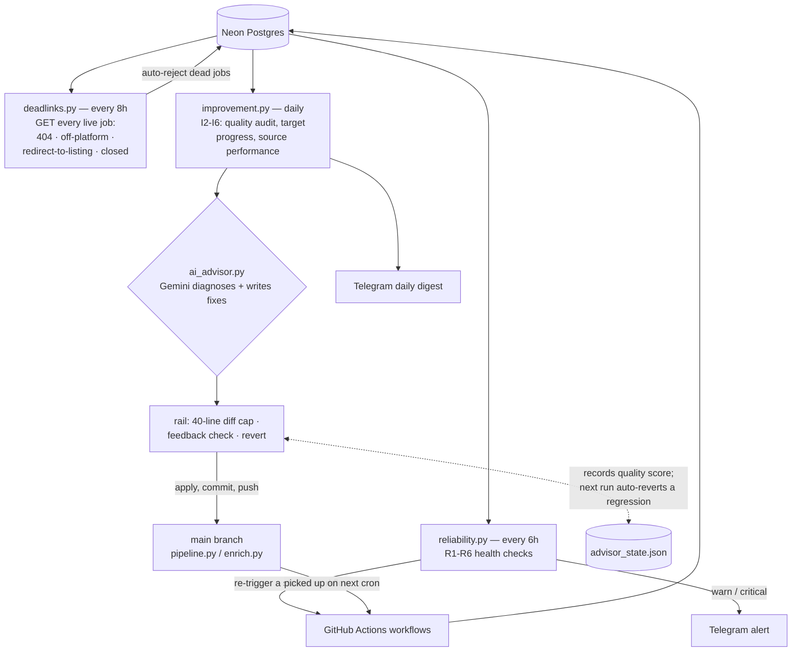

# Architecture & Information Flow

How the product-hiring system works, end to end, as of 2026-05-21.
The diagrams below are Mermaid — they render on GitHub.

---

## What runs, and when

| Job | Workflow | Cadence |
|-----|----------|---------|
| Ingest — Parallel web search | `pipeline-parallel.yml` | daily 01:00 UTC |
| Ingest — JobSpy / Indeed | `pipeline-jobspy.yml` | daily 02:00 UTC |
| Ingest — HN Who-is-Hiring | `pipeline-hn.yml` | daily 03:00 UTC |
| Ingest — Greenhouse + Lever | `pipeline-fast.yml` | daily 04:00 UTC |
| Enrich (LLM extraction) | `enrich.yml` | daily 06:00 UTC |
| Reliability monitor | `monitor-reliability.yml` | every 6h |
| Dead-link sweep | `deadlinks.yml` | every 8h |
| Improvement loop + AI advisor | `monitor-improvement.yml` | daily 08:00 IST |

Everything runs on GitHub Actions cron. Storage is Neon Postgres; the board
is Next.js on Vercel.

---

## 1. Data flow — a job's journey

**In words:** each source workflow runs `pipeline.py`, which classifies and
dedupes new jobs into Neon. `enrich.py` then fetches each job's real
description page and runs **one Gemini call** (`llm_extract`) that returns a
clean title, company, location, domain, India-eligibility and summary; if the
model is unavailable or unsure, the old regex extractors run instead. The
cleaned row is written back with a `review_status`. The board reads Neon and
serves the PM tab by default, with Founder's Office as a separate tab.

---

## 2. Autonomous loops — keeping it healthy and improving

**In words:** three independent loops watch the system. The **dead-link
sweep** removes jobs whose postings have been taken down. The **reliability
loop** checks six health signals and can re-trigger a stalled workflow or
alert on Telegram. The **improvement loop** scores quality, then the **AI
advisor** asks Gemini to fix root causes in `pipeline.py` / `enrich.py` and
pushes to `main` — but railed: a change over 40 lines is rejected, and the
*next* run checks whether the last change moved the quality score; if it
regressed by 3+/20 the change is auto-reverted. The whole loop closes back on
the data: the advisor's commits run on the next cron.

---

## Key components

| Path | Role |
|------|------|
| `scraper/pipeline.py` | Ingest + classify + dedupe, per source |
| `scraper/enrich.py` | Enrichment loop — fetch JD, extract, write back |
| `scraper/llm_extract.py` | The Gemini structured-extraction call |
| `board/` | Next.js board (PM tab, FO tab, `/review`, `/status`) |
| `monitor/reliability.py` | Loop 1 — R1-R6 health checks |
| `monitor/improvement.py` | Loop 2 — I2-I6 quality + target metrics |
| `monitor/deadlinks.py` | Dead-link sweep |
| `monitor/ai_advisor.py` | Self-improvement loop (railed) |
| `monitor/advisor_state.json` | Feedback-rail state, committed across runs |
